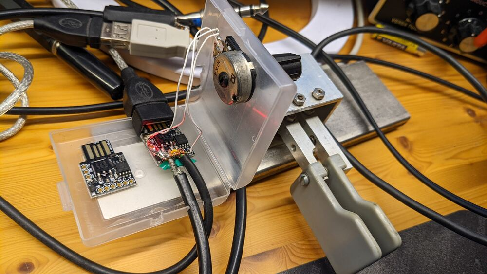

Iambic CW keyer based on DigiSpark, MIDI, and PulseAudio on Linux
=================================================================
Christoph Berg DF7CB, March 2022

Classic ham radio transceivers have physical connectors for morse keys and
microphones. When the transceiver is a software defined radio (SDR) device,
voice operation is easy by attaching a headset, but solutions to connect a
morse key, be it a straight key or paddles, to a modern PC are rare. In the old
times, machines had serial ports with RTS/DTR lines, but these do not exist
anymore, so a new interface is needed.

I am using a LimeSDR as ground station for the QO-100 satellite, and naturally
also wanted to do CW operation there. I started with SDRangel which has a
built-in morse generator, but naturally wanted to connect a CW key. At first
sight, all the bits are there, there's a tune button that could be used as a
straight key, as well as keyboard bindings for dots and dashes. But the delay
key->local audio is almost a full second, so that's a no-go. I then went to
hack my K3NG keyer to output ^ (high) _ (low) signals on the USB interface, and
have a smallish Python program read that and send SDRangel REST API requests.
Works, but that solution always felt "too big" to me, plus the sidetone from
the buzzer inside the Arduino case could be heard in the whole house. And the
total TX-RX delay was well over a second.

Next I tried building some GNU Radio flowcharts to solve the same problem but
which all had the same trouble that the buffers grew way too big to allow the
sidetone to be used for keying. At the same time, I switched the transceiver
from SDRangel to another GR flowchart which reduced the overall TX-RX delay to
something much shorter, but the local audio delay was still too slow for CW.

So after some back and forth, I came up with this solution: the external
interface from the CW paddles to the PC is a small DigiSpark board programmed
to output MIDI signals, and on the (Linux) PC side, there is a Python program
listening for MIDI and acting as a iambic CW keyer. The morse dots and dashes
are uploaded as "samples" to PulseAudio, where they are played both on the
local sidetone channel (usually headphones) and on the audio channel driving
the SDR transceiver. There is no delay. :)

## DigiSpark hardware

The DigiSpark is a very small embedded computer that can be programmed using
the Arduino toolchain.

Of the 6 IO pins, two are used for the USB bus, two connect the dit and dah
lines of the CW paddle, one connects to a potentiometer for adjusting the
keying speed, and the last one is unconnected in this design, but could be used
for keying a physical transceiver. (The onboard LED uses the this pin.)

```
            +---------------+
            |            P5 o  -- 10k potentiometer middle pin
        =====  Attiny85  P4 o  -- USB (internal)
   USB  -----            P3 o  -- USB (internal)
        -----            P2 o  -- dah paddle
        =====   78M05    P1 o  -- (LED/TRX)
            |            P0 o  -- dit paddle
            +---o-o-o-------+
```

There is an extra 27 kΩ resistor in the ground connection of the potentiometer
to keep the P5 voltage > 2.5 V, or else the DigiSpark resets. (This could be
changed by blowing some fuses, but is not necessary.)



The [Arduino sketch](midicwkeyer.ino) for the keyer uses the
[DigisparkMIDI library](https://github.com/heartscrytech/DigisparkMIDI).
The code is quite simple: if the paddles are pressed, send a MIDI note_on event
(dit = note 1, dah = note 2), when released, send note_off. When the
potentiometer is changed, send a control_change event (control 3), the value
read is conveniently scaled to wpm speed values between 8 and 40.

```
    if (dit)
      midi.sendNoteOn(NOTE_DIT, 1);
    else
      midi.sendNoteOff(NOTE_DIT, 0);

    if (dah)
      midi.sendNoteOn(NOTE_DAH, 1);
    else
      midi.sendNoteOff(NOTE_DAH, 0);

    if (new_speed != old_speed)
      midi.sendControlChange(CHANNEL_SPEED, new_speed);
```

The device uses a generic USB id that is recognized by Linux as a MIDI device:

```
$ lsusb
Bus 001 Device 008: ID 16c0:05e4 Van Ooijen Technische Informatica Free shared USB VID/PID pair for MIDI devices

$ amidi -l
Dir Device    Name
IO  hw:2,0,0  MidiStomp MIDI 1

$ aseqdump -l
 Port    Client name                      Port name
 24:0    MidiStomp                        MidiStomp MIDI 1

$ aseqdump --port MidiStomp
Source  Event                  Ch  Data
 24:0   Control change          0, controller 3, value 24
 24:0   Note on                 0, note 1, velocity 1
 24:0   Note on                 0, note 2, velocity 1
 24:0   Note off                0, note 1, velocity 0
 24:0   Note off                0, note 2, velocity 0
 24:0   Control change          0, controller 3, value 25
 24:0   Control change          0, controller 3, value 26
```

## Python and PulseAudio software

On the Linux host side, a [Python program](midicwkeyer.py) is listening for
MIDI events and acts as a iambic CW keyer that converts the stream of note
on/off into CW signals.

Instead of providing a full audio stream, dit and dah "samples" are uploaded to
PulseAudio, and triggered via the
[pulsectl library](https://github.com/mk-fg/python-pulse-control).
On speed changes, new samples are uploaded.
The samples are played on two channels, one for the sidetone on the operator
headphones, and one on the audio input device for the SDR transmitter.


The virtual "tx0" audio device can be created on boot using this systemd config
snippet:

```
# $HOME/.config/systemd/user/pulseaudio.service.d/override.conf
[Service]
ExecStartPost=/usr/bin/pacmd load-module module-null-sink sink_name=tx0 sink_properties=device.description=tx0
```

The CW text sent is printed on stdout:

```
$ ./midicwkeyer.py
TX port is tx0 (3)
Sidetone port is Plantronics Blackwire 3225 Series Analog Stereo (7)
 CQ CQ DF7CB
```

## Author

Copyright (C) 2022 Christoph Berg DF7CB <cb@df7cb.de>

MIT licensed.
